<!-- README.md is generated from README.Rmd. Please edit that file -->
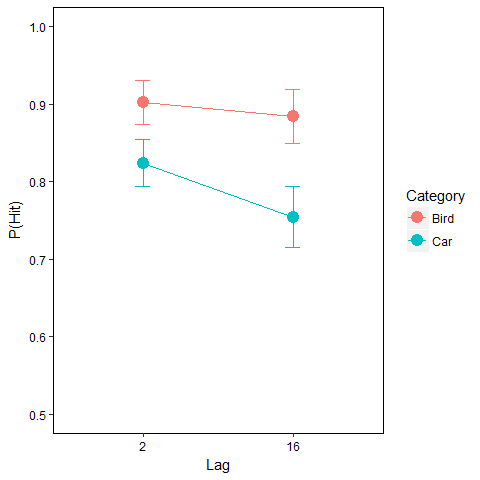

    ## [1] "Experts"

    ##         Effect    df  MSE         F ges      p
    ## 1     category 1, 53 0.02 33.11 *** .15 <.0001
    ## 2          lag 1, 53 0.01 19.31 *** .03 <.0001
    ## 3 category:lag 1, 53 0.00   8.69 ** .01   .005

    ## [1] "Simple Effects"

    ## 
    ##  Paired t-test
    ## 
    ## data:  agg_hit$hit[agg_hit$lag == 2 & agg_hit$category == "bird"] and agg_hit$hit[agg_hit$lag == 16 & agg_hit$category == "bird"]
    ## t = 1.635, df = 53, p-value = 0.108
    ## alternative hypothesis: true difference in means is not equal to 0
    ## 95 percent confidence interval:
    ##  -0.004089202  0.040156578
    ## sample estimates:
    ## mean of the differences 
    ##              0.01803369

    ## 
    ##  Paired t-test
    ## 
    ## data:  agg_hit$hit[agg_hit$lag == 2 & agg_hit$category == "car"] and agg_hit$hit[agg_hit$lag == 16 & agg_hit$category == "car"]
    ## t = 4.5926, df = 53, p-value = 2.734e-05
    ## alternative hypothesis: true difference in means is not equal to 0
    ## 95 percent confidence interval:
    ##  0.03912937 0.09980700
    ## sample estimates:
    ## mean of the differences 
    ##              0.06946819

    ## [1] "Means"

    ##   lag category  N       hit        sd         se         ci
    ## 1   2     bird 54 0.9022080 0.1031960 0.01404319 0.02816708
    ## 2   2      car 54 0.8238960 0.1115085 0.01517438 0.03043595
    ## 3  16     bird 54 0.8841743 0.1286687 0.01750959 0.03511978
    ## 4  16      car 54 0.7544278 0.1437266 0.01955872 0.03922982

    ##   category  N       hit        sd         se         ci
    ## 1     bird 54 0.8931821 0.1093634 0.01488247 0.02985045
    ## 2      car 54 0.7891159 0.1160553 0.01579312 0.03167700

    ##   lag  N       hit         sd         se         ci
    ## 1   2 54 0.8630860 0.08794336 0.01196757 0.02400392
    ## 2  16 54 0.8192323 0.10749481 0.01462819 0.02934044

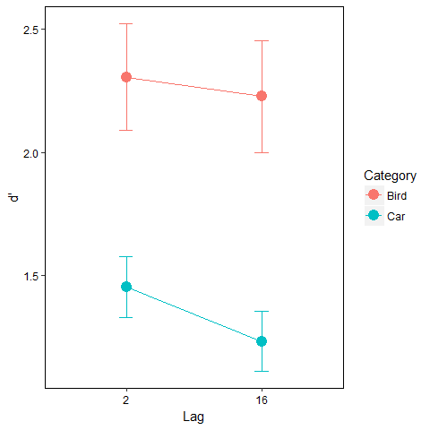

    ## [1] "Experts"

    ##         Effect    df  MSE         F  ges      p
    ## 1     category 1, 53 0.52 86.93 ***  .33 <.0001
    ## 2          lag 1, 53 0.09 13.12 ***  .01  .0007
    ## 3 category:lag 1, 53 0.08    3.50 + .003    .07

    ##   category  N   dprime        sd         se        ci
    ## 1     bird 54 2.278050 0.8017265 0.10910116 0.2188292
    ## 2      car 54 1.339083 0.3996735 0.05438867 0.1090899

    ##   lag  N   dprime        sd         se        ci
    ## 1   2 54 1.816209 0.5133600 0.06985945 0.1401203
    ## 2  16 54 1.641724 0.4877484 0.06637415 0.1331297

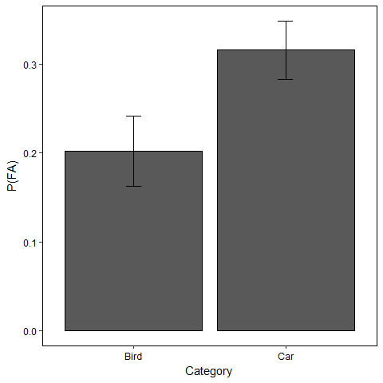

    ## [1] "Experts"

    ##   category  N        fa        sd         se         ci
    ## 1     bird 54 0.2022791 0.1453845 0.01978432 0.03968232
    ## 2      car 54 0.3158766 0.1191935 0.01622018 0.03253355

    ## 
    ##  Paired t-test
    ## 
    ## data:  agg_fa$fa[agg_fa$category == "bird"] and agg_fa$fa[agg_fa$category == "car"]
    ## t = -7.2244, df = 53, p-value = 1.964e-09
    ## alternative hypothesis: true difference in means is not equal to 0
    ## 95 percent confidence interval:
    ##  -0.14513644 -0.08205869
    ## sample estimates:
    ## mean of the differences 
    ##              -0.1135976

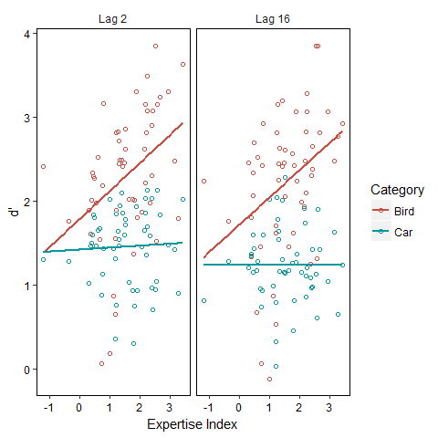

    ## 
    ## Type III Repeated Measures MANOVA Tests: Pillai test statistic
    ##                                    Df test stat approx F num Df den Df    Pr(>F)    
    ## (Intercept)                         1   0.93542   738.72      1     51 < 2.2e-16 ***
    ## delta_dprime_centered               1   0.07581     4.18      1     51 0.0460019 *  
    ## age                                 1   0.01119     0.58      1     51 0.4509450    
    ## category                            1   0.67729   107.04      1     51 3.994e-14 ***
    ## delta_dprime_centered:category      1   0.11941     6.92      1     51 0.0112677 *  
    ## age:category                        1   0.05895     3.19      1     51 0.0798209 .  
    ## lag                                 1   0.19925    12.69      1     51 0.0008076 ***
    ## delta_dprime_centered:lag           1   0.00397     0.20      1     51 0.6538652    
    ## age:lag                             1   0.00258     0.13      1     51 0.7179049    
    ## category:lag                        1   0.06316     3.44      1     51 0.0694858 .  
    ## delta_dprime_centered:category:lag  1   0.00038     0.02      1     51 0.8901495    
    ## age:category:lag                    1   0.02081     1.08      1     51 0.3027474    
    ## ---
    ## Signif. codes:  0 '***' 0.001 '**' 0.01 '*' 0.05 '.' 0.1 ' ' 1

    ## [1] "simple lm birds"

    ## 
    ## Call:
    ## lm(formula = dprime ~ delta_dprime, data = agg_dprime[agg_dprime$category == 
    ##     "bird", ])
    ## 
    ## Residuals:
    ##     Min      1Q  Median      3Q     Max 
    ## -2.0667 -0.4070  0.1744  0.5061  1.5038 
    ## 
    ## Coefficients:
    ##              Estimate Std. Error t value Pr(>|t|)    
    ## (Intercept)    1.7716     0.1980   8.949 4.16e-12 ***
    ## delta_dprime   0.3289     0.1103   2.982  0.00435 ** 
    ## ---
    ## Signif. codes:  0 '***' 0.001 '**' 0.01 '*' 0.05 '.' 0.1 ' ' 1
    ## 
    ## Residual standard error: 0.748 on 52 degrees of freedom
    ## Multiple R-squared:  0.1461, Adjusted R-squared:  0.1296 
    ## F-statistic: 8.894 on 1 and 52 DF,  p-value: 0.004347

    ## [1] "simple lm cars"

    ## 
    ## Call:
    ## lm(formula = dprime ~ delta_dprime, data = agg_dprime[agg_dprime$category == 
    ##     "car", ])
    ## 
    ## Residuals:
    ##      Min       1Q   Median       3Q      Max 
    ## -1.13936 -0.24219  0.07712  0.24854  0.70373 
    ## 
    ## Coefficients:
    ##              Estimate Std. Error t value Pr(>|t|)    
    ## (Intercept)  1.330510   0.106790  12.459   <2e-16 ***
    ## delta_dprime 0.005569   0.059498   0.094    0.926    
    ## ---
    ## Signif. codes:  0 '***' 0.001 '**' 0.01 '*' 0.05 '.' 0.1 ' ' 1
    ## 
    ## Residual standard error: 0.4035 on 52 degrees of freedom
    ## Multiple R-squared:  0.0001684,  Adjusted R-squared:  -0.01906 
    ## F-statistic: 0.00876 on 1 and 52 DF,  p-value: 0.9258

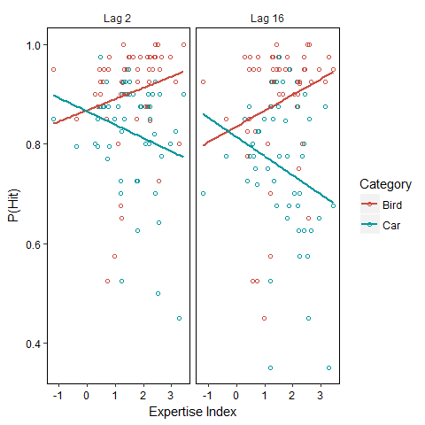

    ##                                Effect    df  MSE         F   ges      p
    ## 1               delta_dprime_centered 1, 51 0.03      0.21  .002    .65
    ## 2                                 age 1, 51 0.03      0.76  .009    .39
    ## 3                            category 1, 51 0.01 40.95 ***   .17 <.0001
    ## 4      delta_dprime_centered:category 1, 51 0.01   7.44 **   .03   .009
    ## 5                        age:category 1, 51 0.01    2.95 +   .01    .09
    ## 6                                 lag 1, 51 0.01 18.65 ***   .03 <.0001
    ## 7           delta_dprime_centered:lag 1, 51 0.01      0.06 .0001    .81
    ## 8                             age:lag 1, 51 0.01      0.18 .0003    .67
    ## 9                        category:lag 1, 51 0.00   8.63 **   .01   .005
    ## 10 delta_dprime_centered:category:lag 1, 51 0.00      0.73  .001    .40
    ## 11                   age:category:lag 1, 51 0.00      0.40 .0006    .53

    ## 
    ## Type III Repeated Measures MANOVA Tests: Pillai test statistic
    ##                                    Df test stat approx F num Df den Df    Pr(>F)    
    ## (Intercept)                         1   0.98880   4501.3      1     51 < 2.2e-16 ***
    ## delta_dprime_centered               1   0.00412      0.2      1     51  0.648087    
    ## age                                 1   0.01460      0.8      1     51  0.388738    
    ## category                            1   0.44535     41.0      1     51 4.835e-08 ***
    ## delta_dprime_centered:category      1   0.12727      7.4      1     51  0.008737 ** 
    ## age:category                        1   0.05466      2.9      1     51  0.091998 .  
    ## lag                                 1   0.26777     18.7      1     51 7.252e-05 ***
    ## delta_dprime_centered:lag           1   0.00111      0.1      1     51  0.812473    
    ## age:lag                             1   0.00354      0.2      1     51  0.672048    
    ## category:lag                        1   0.14468      8.6      1     51  0.004961 ** 
    ## delta_dprime_centered:category:lag  1   0.01421      0.7      1     51  0.395290    
    ## age:category:lag                    1   0.00769      0.4      1     51  0.532476    
    ## ---
    ## Signif. codes:  0 '***' 0.001 '**' 0.01 '*' 0.05 '.' 0.1 ' ' 1

    ## [1] "simple lm birds"

    ## 
    ## Call:
    ## lm(formula = hit ~ delta_dprime, data = agg_hit_overall[agg_hit_overall$category == 
    ##     "bird", ])
    ## 
    ## Residuals:
    ##      Min       1Q   Median       3Q      Max 
    ## -0.36577 -0.01787  0.03097  0.06274  0.11856 
    ## 
    ## Coefficients:
    ##              Estimate Std. Error t value Pr(>|t|)    
    ## (Intercept)   0.85131    0.02843  29.946   <2e-16 ***
    ## delta_dprime  0.02720    0.01584   1.717   0.0919 .  
    ## ---
    ## Signif. codes:  0 '***' 0.001 '**' 0.01 '*' 0.05 '.' 0.1 ' ' 1
    ## 
    ## Residual standard error: 0.1074 on 52 degrees of freedom
    ## Multiple R-squared:  0.05367,    Adjusted R-squared:  0.03547 
    ## F-statistic: 2.949 on 1 and 52 DF,  p-value: 0.09187

    ## [1] "simple lm cars"

    ## 
    ## Call:
    ## lm(formula = hit ~ delta_dprime, data = agg_hit_overall[agg_hit_overall$category == 
    ##     "car", ])
    ## 
    ## Residuals:
    ##      Min       1Q   Median       3Q      Max 
    ## -0.36231 -0.03871  0.01229  0.06006  0.14757 
    ## 
    ## Coefficients:
    ##              Estimate Std. Error t value Pr(>|t|)    
    ## (Intercept)   0.83964    0.02992  28.066   <2e-16 ***
    ## delta_dprime -0.03282    0.01667  -1.969   0.0543 .  
    ## ---
    ## Signif. codes:  0 '***' 0.001 '**' 0.01 '*' 0.05 '.' 0.1 ' ' 1
    ## 
    ## Residual standard error: 0.113 on 52 degrees of freedom
    ## Multiple R-squared:  0.06938,    Adjusted R-squared:  0.05149 
    ## F-statistic: 3.877 on 1 and 52 DF,  p-value: 0.05429

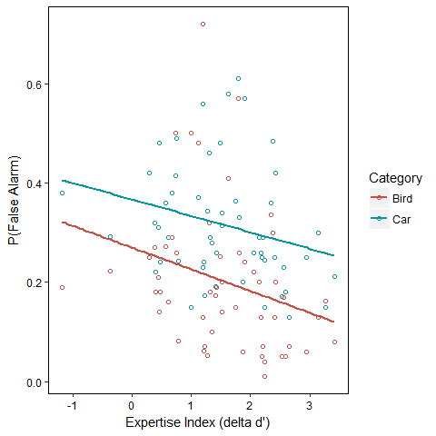

    ## 
    ## Type III Repeated Measures MANOVA Tests: Pillai test statistic
    ##                                Df test stat approx F num Df den Df    Pr(>F)    
    ## (Intercept)                     1   0.83971  267.165      1     51 < 2.2e-16 ***
    ## delta_dprime_centered           1   0.08028    4.452      1     51   0.03979 *  
    ## age                             1   0.00008    0.004      1     51   0.94798    
    ## category                        1   0.50386   51.793      1     51 2.661e-09 ***
    ## delta_dprime_centered:category  1   0.00137    0.070      1     51   0.79281    
    ## age:category                    1   0.02307    1.204      1     51   0.27759    
    ## ---
    ## Signif. codes:  0 '***' 0.001 '**' 0.01 '*' 0.05 '.' 0.1 ' ' 1

    ## [1] "simple lm"

    ## 
    ## Call:
    ## lm(formula = fa ~ delta_dprime, data = aggregate(fa ~ subj_num * 
    ##     delta_dprime, agg_fa, mean))
    ## 
    ## Residuals:
    ##      Min       1Q   Median       3Q      Max 
    ## -0.14955 -0.08072 -0.03438  0.04438  0.36766 
    ## 
    ## Coefficients:
    ##              Estimate Std. Error t value Pr(>|t|)    
    ## (Intercept)   0.31816    0.03053  10.420 2.46e-14 ***
    ## delta_dprime -0.03838    0.01701  -2.256   0.0283 *  
    ## ---
    ## Signif. codes:  0 '***' 0.001 '**' 0.01 '*' 0.05 '.' 0.1 ' ' 1
    ## 
    ## Residual standard error: 0.1154 on 52 degrees of freedom
    ## Multiple R-squared:  0.08916,    Adjusted R-squared:  0.07165 
    ## F-statistic:  5.09 on 1 and 52 DF,  p-value: 0.02829

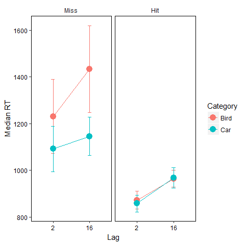

    ## [1] "Hit RT"

    ## 
    ## Type III Repeated Measures MANOVA Tests: Pillai test statistic
    ##              Df test stat approx F num Df den Df    Pr(>F)    
    ## (Intercept)   1   0.98225  2933.41      1     53 < 2.2e-16 ***
    ## category      1   0.00432     0.23      1     53    0.6334    
    ## lag           1   0.62291    87.55      1     53  8.16e-13 ***
    ## category:lag  1   0.02236     1.21      1     53    0.2759    
    ## ---
    ## Signif. codes:  0 '***' 0.001 '**' 0.01 '*' 0.05 '.' 0.1 ' ' 1

    ##   lag  N       rt       sd       se       ci
    ## 1   2 54 864.9175 125.9632 17.14142 34.38134
    ## 2  16 54 965.9337 134.6594 18.32482 36.75494

    ## [1] "Miss RT"

    ## 
    ## Type III Repeated Measures MANOVA Tests: Pillai test statistic
    ##              Df test stat approx F num Df den Df    Pr(>F)    
    ## (Intercept)   1   0.91615   513.56      1     47 < 2.2e-16 ***
    ## category      1   0.15293     8.49      1     47  0.005463 ** 
    ## lag           1   0.18033    10.34      1     47  0.002356 ** 
    ## category:lag  1   0.04778     2.36      1     47  0.131315    
    ## ---
    ## Signif. codes:  0 '***' 0.001 '**' 0.01 '*' 0.05 '.' 0.1 ' ' 1

    ##   lag  N       rt       sd       se       ci
    ## 1   2 54 1155.628 383.9902 52.25444 104.8091
    ## 2  16 54 1282.519 397.3317 54.06999 108.4507

    ##   category  N       rt       sd       se        ci
    ## 1     bird 53 1346.922 555.4447 76.29620 153.09952
    ## 2      car 54 1118.830 300.6693 40.91591  82.06693

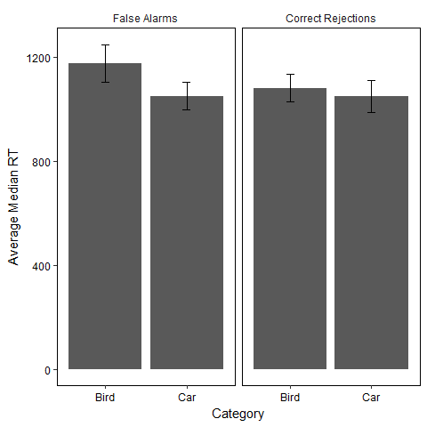

    ## [1] "False Alarm RT"

    ## 
    ## Type III Repeated Measures MANOVA Tests: Pillai test statistic
    ##             Df test stat approx F num Df den Df    Pr(>F)    
    ## (Intercept)  1   0.96945  1681.75      1     53 < 2.2e-16 ***
    ## category     1   0.22097    15.03      1     53 0.0002933 ***
    ## ---
    ## Signif. codes:  0 '***' 0.001 '**' 0.01 '*' 0.05 '.' 0.1 ' ' 1

    ##   category  N       rt       sd       se       ci
    ## 1     bird 54 1176.106 266.0204 36.20079 72.60959
    ## 2      car 54 1050.969 192.3186 26.17124 52.49287

    ## [1] "Correct Rejection RT"

    ## 
    ## Type III Repeated Measures MANOVA Tests: Pillai test statistic
    ##             Df test stat approx F num Df den Df Pr(>F)    
    ## (Intercept)  1   0.96930  1673.29      1     53 <2e-16 ***
    ## category     1   0.03884     2.14      1     53 0.1493    
    ## ---
    ## Signif. codes:  0 '***' 0.001 '**' 0.01 '*' 0.05 '.' 0.1 ' ' 1

    ##   category  N       rt       sd       se       ci
    ## 1     bird 54 1081.623 191.7694 26.09650 52.34296
    ## 2      car 54 1049.081 223.2273 30.37738 60.92931

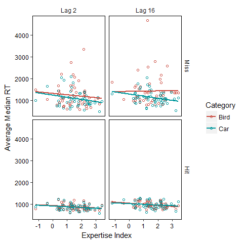

    ## [1] "Hit RT"

    ## 
    ## Type III Repeated Measures MANOVA Tests: Pillai test statistic
    ##                                    Df test stat approx F num Df den Df    Pr(>F)    
    ## (Intercept)                         1   0.98514   3381.8      1     51 < 2.2e-16 ***
    ## delta_dprime_centered               1   0.03425      1.8      1     51   0.18463    
    ## age                                 1   0.09681      5.5      1     51   0.02335 *  
    ## category                            1   0.00464      0.2      1     51   0.62809    
    ## delta_dprime_centered:category      1   0.00004      0.0      1     51   0.96285    
    ## age:category                        1   0.06080      3.3      1     51   0.07509 .  
    ## lag                                 1   0.62380     84.6      1     51 2.075e-12 ***
    ## delta_dprime_centered:lag           1   0.00377      0.2      1     51   0.66228    
    ## age:lag                             1   0.00029      0.0      1     51   0.90339    
    ## category:lag                        1   0.02295      1.2      1     51   0.27884    
    ## delta_dprime_centered:category:lag  1   0.00383      0.2      1     51   0.65976    
    ## age:category:lag                    1   0.01599      0.8      1     51   0.36687    
    ## ---
    ## Signif. codes:  0 '***' 0.001 '**' 0.01 '*' 0.05 '.' 0.1 ' ' 1

    ##                                Effect    df      MSE         F    ges      p
    ## 1               delta_dprime_centered 1, 51 53524.01      1.81    .03    .18
    ## 2                                 age 1, 51 53524.01    5.47 *    .07    .02
    ## 3                            category 1, 51  7906.26      0.24  .0005    .63
    ## 4      delta_dprime_centered:category 1, 51  7906.26      0.00 <.0001    .96
    ## 5                        age:category 1, 51  7906.26    3.30 +   .007    .08
    ## 6                                 lag 1, 51  6516.05 84.57 ***    .13 <.0001
    ## 7           delta_dprime_centered:lag 1, 51  6516.05      0.19  .0003    .66
    ## 8                             age:lag 1, 51  6516.05      0.01 <.0001    .90
    ## 9                        category:lag 1, 51  3746.84      1.20   .001    .28
    ## 10 delta_dprime_centered:category:lag 1, 51  3746.84      0.20  .0002    .66
    ## 11                   age:category:lag 1, 51  3746.84      0.83  .0008    .37

    ## 
    ## Call:
    ## lm(formula = rt ~ age, data = agg_temp[agg_temp$acc == 1 & agg_temp$tarfoil_int == 
    ##     1, ])
    ## 
    ## Residuals:
    ##     Min      1Q  Median      3Q     Max 
    ## -209.13  -78.27  -22.43   70.05  252.63 
    ## 
    ## Coefficients:
    ##             Estimate Std. Error t value Pr(>|t|)    
    ## (Intercept)  755.139     50.762  14.876  < 2e-16 ***
    ## age            3.493      1.080   3.234  0.00212 ** 
    ## ---
    ## Signif. codes:  0 '***' 0.001 '**' 0.01 '*' 0.05 '.' 0.1 ' ' 1
    ## 
    ## Residual standard error: 111.3 on 52 degrees of freedom
    ## Multiple R-squared:  0.1674, Adjusted R-squared:  0.1514 
    ## F-statistic: 10.46 on 1 and 52 DF,  p-value: 0.002124

    ## [1] "Miss RT"

    ## 
    ## Type III Repeated Measures MANOVA Tests: Pillai test statistic
    ##                                    Df test stat approx F num Df den Df    Pr(>F)    
    ## (Intercept)                         1   0.34285  23.4774      1     45 1.537e-05 ***
    ## delta_dprime_centered               1   0.00463   0.2091      1     45   0.64965    
    ## age                                 1   0.07863   3.8402      1     45   0.05625 .  
    ## category                            1   0.00111   0.0502      1     45   0.82377    
    ## delta_dprime_centered:category      1   0.03908   1.8299      1     45   0.18290    
    ## age:category                        1   0.02826   1.3085      1     45   0.25872    
    ## lag                                 1   0.02997   1.3901      1     45   0.24458    
    ## delta_dprime_centered:lag           1   0.01183   0.5385      1     45   0.46685    
    ## age:lag                             1   0.00145   0.0653      1     45   0.79952    
    ## category:lag                        1   0.02326   1.0717      1     45   0.30609    
    ## delta_dprime_centered:category:lag  1   0.01280   0.5833      1     45   0.44902    
    ## age:category:lag                    1   0.00796   0.3610      1     45   0.55097    
    ## ---
    ## Signif. codes:  0 '***' 0.001 '**' 0.01 '*' 0.05 '.' 0.1 ' ' 1

    ## 
    ## Call:
    ## lm(formula = rt ~ age, data = agg_temp[agg_temp$acc == 0 & agg_temp$tarfoil_int == 
    ##     1, ])
    ## 
    ## Residuals:
    ##     Min      1Q  Median      3Q     Max 
    ## -510.56 -188.53  -67.42  117.28 1383.93 
    ## 
    ## Coefficients:
    ##             Estimate Std. Error t value Pr(>|t|)    
    ## (Intercept)  807.683    144.952   5.572 9.05e-07 ***
    ## age            7.370      3.085   2.389   0.0205 *  
    ## ---
    ## Signif. codes:  0 '***' 0.001 '**' 0.01 '*' 0.05 '.' 0.1 ' ' 1
    ## 
    ## Residual standard error: 317.7 on 52 degrees of freedom
    ## Multiple R-squared:  0.09892,    Adjusted R-squared:  0.08159 
    ## F-statistic: 5.708 on 1 and 52 DF,  p-value: 0.02055

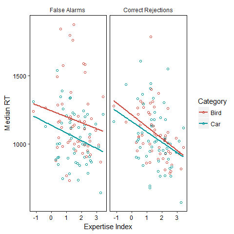

    ## [1] "False Alarm RT"

    ## 
    ## Type III Repeated Measures MANOVA Tests: Pillai test statistic
    ##                                Df test stat approx F num Df den Df    Pr(>F)    
    ## (Intercept)                     1   0.97301  1838.36      1     51 < 2.2e-16 ***
    ## delta_dprime_centered           1   0.02351     1.23      1     51 0.2730268    
    ## age                             1   0.06885     3.77      1     51 0.0576841 .  
    ## category                        1   0.22168    14.53      1     51 0.0003737 ***
    ## delta_dprime_centered:category  1   0.00128     0.07      1     51 0.7991078    
    ## age:category                    1   0.00161     0.08      1     51 0.7757814    
    ## ---
    ## Signif. codes:  0 '***' 0.001 '**' 0.01 '*' 0.05 '.' 0.1 ' ' 1

    ## [1] "Correct Rejction RT"

    ## 
    ## Type III Repeated Measures MANOVA Tests: Pillai test statistic
    ##                                Df test stat approx F num Df den Df  Pr(>F)    
    ## (Intercept)                     1   0.97599  2072.90      1     51 < 2e-16 ***
    ## delta_dprime_centered           1   0.10257     5.83      1     51 0.01939 *  
    ## age                             1   0.07971     4.42      1     51 0.04054 *  
    ## category                        1   0.03935     2.09      1     51 0.15448    
    ## delta_dprime_centered:category  1   0.00790     0.41      1     51 0.52687    
    ## age:category                    1   0.00976     0.50      1     51 0.48156    
    ## ---
    ## Signif. codes:  0 '***' 0.001 '**' 0.01 '*' 0.05 '.' 0.1 ' ' 1

    ## 
    ## Call:
    ## lm(formula = rt ~ age + delta_dprime_centered, data = aggregate(rt ~ 
    ##     subj_num * age * delta_dprime_centered, agg_rt_foils[agg_rt_foils$tarfoil_int == 
    ##     0 & agg_rt_foils$acc == 1, ], mean))
    ## 
    ## Residuals:
    ##     Min      1Q  Median      3Q     Max 
    ## -336.42 -122.34  -40.83  105.47  522.80 
    ## 
    ## Coefficients:
    ##                       Estimate Std. Error t value Pr(>|t|)    
    ## (Intercept)           1065.352     23.399  45.529   <2e-16 ***
    ## age                      3.681      1.751   2.102   0.0405 *  
    ## delta_dprime_centered  -64.228     26.604  -2.414   0.0194 *  
    ## ---
    ## Signif. codes:  0 '***' 0.001 '**' 0.01 '*' 0.05 '.' 0.1 ' ' 1
    ## 
    ## Residual standard error: 171.9 on 51 degrees of freedom
    ## Multiple R-squared:  0.2232, Adjusted R-squared:  0.1928 
    ## F-statistic: 7.329 on 2 and 51 DF,  p-value: 0.001593

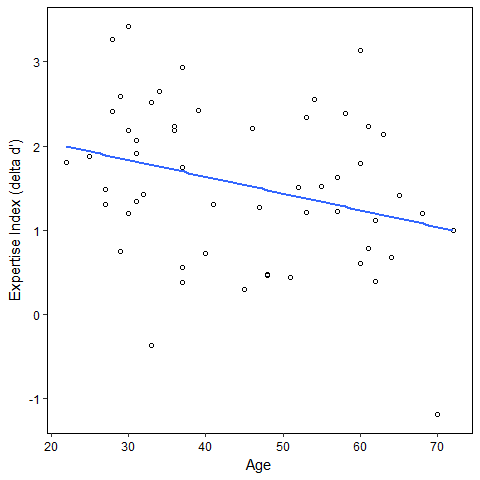

    ## 
    ##  Pearson's product-moment correlation
    ## 
    ## data:  agg_age$age and agg_age$delta_dprime
    ## t = -2.2888, df = 52, p-value = 0.02618
    ## alternative hypothesis: true correlation is not equal to 0
    ## 95 percent confidence interval:
    ##  -0.52755130 -0.03782829
    ## sample estimates:
    ##        cor 
    ## -0.3025246
